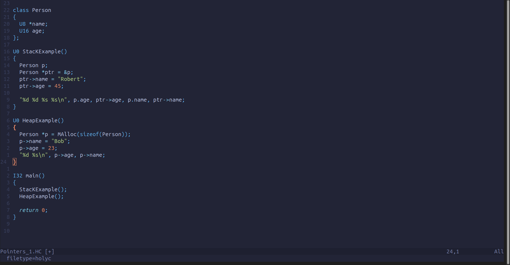

# holyc.nvim

[](https://opensource.org/licenses/MIT)    

A Neovim plugin for the HolyC language, providing syntax highlighting, snippets, and code formatting.

---

## Preview



---

## Features

- **Syntax Highlighting**: Accurate highlighting for HolyC keywords, types, strings, and comments.
- **Code Snippets**: A collection of useful snippets for `main`, `for`, `if`, etc., for use with LuaSnip.
- **Code Formatting**: An on-demand code formatter that integrates with `formatter.nvim`.
- **LSP Ready**: Includes a configuration template to easily connect a future or custom HolyC Language Server.

---

## Installation

Install with your favorite plugin manager.

### Using `lazy.nvim`

1. Add holyc.nvim to your plugins:

```lua
    -- In your plugins setup file
    return {
      -- Other plugins like nvim-cmp, luasnip, formatter.nvim...
      
      {
        "YourUsername/holyc.nvim",
        -- Optional: Load it only for HolyC files for faster startup
        ft = "holyc", 
        -- This plugin needs these other plugins to work
        dependencies = { "nvim-lua/plenary.nvim" } 
      },
    }
```
> (Note: We were considering adding a `samples.lua` file inside the plugin that would use Telescope. `lazy.nvim` would require `nvim-telescope/telescope.nvim` if we add it).

2. **Install Node.js Dependencies:**

The code formatter requires `js-beautify`. After the plugin is installed, you must run:

```bash
-- Navigate to the installed plugin's scripts directory and run npm install
cd ~/.local/share/nvim/lazy/holyc.nvim/scripts/ && npm install
```

---

## Configuration

`holyc.nvim` works out of the box, but you need to configure other plugins to use its features.

### Formatter Setup

Configure `formatter.nvim` to use the script provided by this plugin.

```lua
-- In your formatter.nvim config
require("formatter").setup({
  filetype = {
    holyc = function()
      -- Find where lazy.nvim installed the plugin
      local plugin = require("lazy.core.config").spec.plugins["holyc.nvim"]
      if not plugin then return end
      local plugin_path = plugin.dir
      
      return {
        exe = "node",
        args = { plugin_path .. "/scripts/format-holyc.js" },
        stdin = true,
      }
    end
  }
})
```

### Snippets Setup

Configure `luasnip` to load snippets from this plugin's directory.

```lua      
-- In your completion/luasnip config
local plugin = require("lazy.core.config").spec.plugins["holyc.nvim"]
if plugin then
  require("luasnip.loaders.from_lua").load({
    paths = { plugin.dir .. "/snippets" }
  })
end
```

---

## Usage

- Syntax Highlighting: Enabled automatically for .HC and .hc files.
- Snippets: Available in nvim-cmp after being loaded by LuaSnip.
- Formatting: Run :Format or use your keymap for formatter.nvim.

---

## Contributing

Contributions are welcome! Please open an issue or submit a pull request.

---

> Why do I do this? Fun, and fun.
